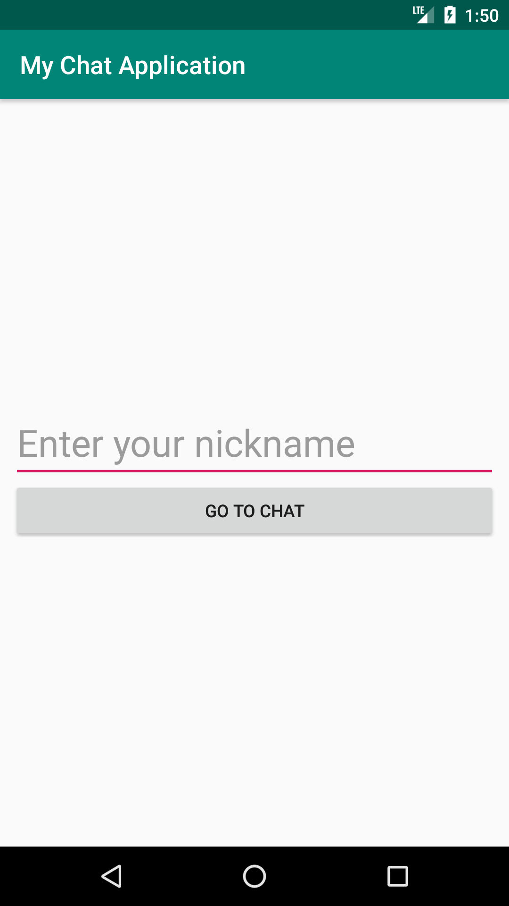

# MyChatApplication
Androidチャットアプリを作る ( Node.js + Socket.io + Android )
https://www.hiramine.com/programming/chat_nodejs_socketio_android/index.html

## Screenshots : スクリーンショット
  

## Requirements : 必要条件、依存関係
- Android Studio : 3.4.2
- Node.js : version 8.12.0
- Express : version 4.16.3
- Socket.io : version 2.1.1

## Author : 作者
Nobuki HIRAMINE : [http://www.hiramine.com](http://www.hiramine.com)

## License : ライセンス
```
Copyright 2019 Nobuki HIRAMINE

Licensed under the Apache License, Version 2.0 (the "License");
you may not use this file except in compliance with the License.
You may obtain a copy of the License at

    http://www.apache.org/licenses/LICENSE-2.0

Unless required by applicable law or agreed to in writing, software
distributed under the License is distributed on an "AS IS" BASIS,
WITHOUT WARRANTIES OR CONDITIONS OF ANY KIND, either express or implied.
See the License for the specific language governing permissions and
limitations under the License.
```
