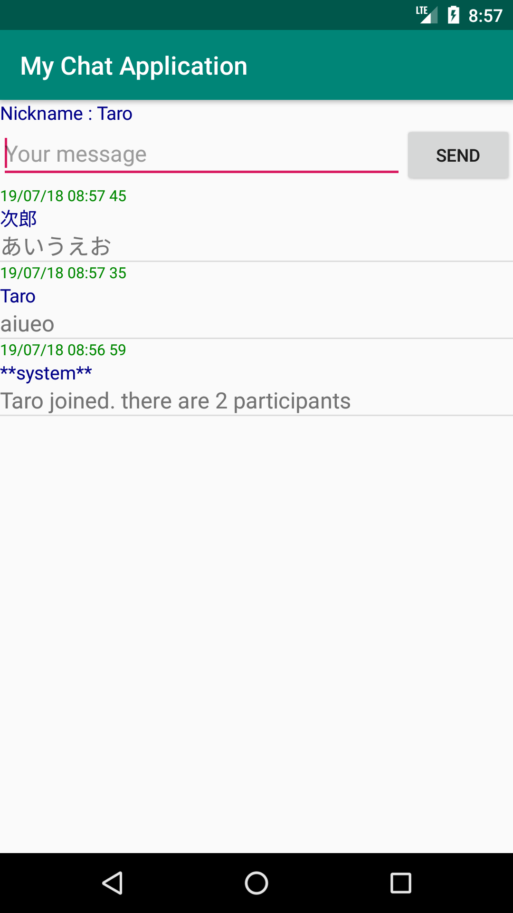

# MyChatApplication
Androidチャットアプリを作る ( Node.js + Socket.io + Android )
https://www.hiramine.com/programming/chat_nodejs_socketio_android/index.html

## Screenshots : スクリーンショット
  

## Requirements : 必要条件、依存関係
- Android Studio : 3.4.2
- Node.js : version 8.12.0
- Express : version 4.16.3
- Socket.io : version 2.1.1

## Author : 作者
Nobuki HIRAMINE : http://www.hiramine.com

## License : ライセンス
Copyright 2019 Nobuki HIRAMINE  
The source code is licensed under the Apache License, Version 2.0.  
See the [LICENSE](LICENSE) file for more details.  
(本アプリケーションのソースコードのライセンスは、「Apache License, Version 2.0」です。  
詳細は「[LICENSE](LICENSE)」ファイルを参照ください。)
